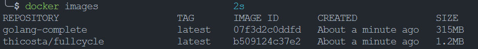
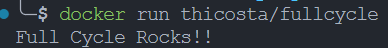

# Desafio 01 de Docker
## Requisitos do projeto
Esse desafio é muito empolgante principalmente se você nunca trabalhou com a linguagem Go!

Você terá que publicar uma imagem no docker hub. Quando executarmos:
```bash
$ docker run <seu-user>/fullcycle
```

Temos que ter o seguinte resultado: 
```bash
Full Cycle Rocks!!
```

Se você perceber, essa imagem apenas realiza um print da mensagem como resultado final, logo, vale a pena dar uma conferida no próprio site da Go Lang para aprender como fazer um "olá mundo".

Lembrando que a Go Lang possui imagens oficiais prontas, vale a pena consultar o Docker Hub.

OBS.: A imagem de nosso projeto Go precisa ter menos de 2MB =)

Dica: No vídeo de introdução sobre o Docker quando falamos sobre o sistema de arquivos em camadas, apresento uma imagem "raiz", talvez seja uma boa utilizá-la.

Suba o projeto em um repositório Git remoto e coloque o link da imagem que subiu no Docker Hub.

Compartilhe o link do repositório do Git remoto para corrigirmos seu projeto.

Divirta-se!

## Projeto
Foram feitos 2 arquivos Dockerfile:
* Dockerfile: arquivo de imagem go do alpine;
* Dockerfile.minified: arquivo de imagem go do alpine com multi-stage build para compilar a aplicação e utilizar apenas o arquivo compilado na imagem;

### Dockerfile padrão

Esse foi o arquivo padrão de Dockerfile utilizado

```dockerfile
# syntax=docker/dockerfile:1

FROM golang:1.17-alpine as builder

# Definir WORKDIR
WORKDIR /usr/src

# Copiar arquivos go.mod e arquivos de código
COPY go.mod *.go ./

# Buildar aplicação e remover informações de debug
RUN go build -ldflags '-s -w' -o hello

CMD ["./hello"]
```

### Dockerfile.minified

Esse foi o arquivo do Dockerfile minificado:
```dockerfile
# syntax=docker/dockerfile:1

FROM golang:1.17-alpine as builder

# Definir WORKDIR
WORKDIR /usr/src

# Copiar arquivos go.mod e arquivos de código
COPY go.mod *.go ./

# Buildar aplicação e remover informações de debug
RUN go build -ldflags '-s -w' -o hello

FROM scratch

WORKDIR /
COPY --from=builder /usr/src /
CMD ["./hello"]
```

Para diminuir o padrão do executável utilizou-se as ldflags '`-s -w`'

### Build
```bash
$ docker build -t thicosta/fullcycle . -f Dockerfile.minified
```

### Imagens geradas


### Execução


### Imagem no dockerhub
#### Login
```bash
$ docker login
```

#### Push
```bash
$ docker push thicosta/fullcycle
```

#### Pull

```bash
$ docker pull thicosta/fullcycle
```

# Referências
* Scratch image: https://hub.docker.com/_/scratch/
* ldflags: https://stackoverflow.com/questions/22267189/what-does-the-w-flag-mean-when-passed-in-via-the-ldflags-option-to-the-go-comman
* golang image: https://hub.docker.com/_/golang
* Tutorial de compilação de aplicação go: https://go.dev/doc/tutorial/compile-install
* O que é arquivo go.mod e go.sum: https://aprendagolang.com.br/2022/06/17/entenda-o-que-sao-os-arquivos-go-mod-e-go-sum/